# 🗺️ FRIDGE QUEST 개발 계획서 (Development Roadmap)

> **프로젝트명**: FRIDGE QUEST — 냉장고 식재료 구조 퀘스트 (5시간 MVP)  
> **기준 문서**: `PRD.md` (FRIDGE QUEST 최종 PRD)  
> **문서 버전**: v1.0.0  
> **작성일**: 2026-08-26  

---

## 1. 프로젝트 개요 및 핵심 목표

### 1.1 핵심 가치
> 🧊 **“내가 가진 것 + 재료 상태”를 입력하면, AI가 “오늘 무엇부터 어떻게 먹을지” 하나의 구조 퀘스트로 결정해준다.**

### 1.2 핵심 성공 조건
1. **단일 화면 구성**: 서비스 소개 → 기본 재료 체크 → 냉털 재료/상태 입력 → 조리시간 → QUEST 생성 → AI 결과가 하나의 페이지에서 매끄럽게 동작.
2. **식재료 상태 기반 우선순위 처리**:
   - 🟡 (시들거나 물러졌어요): 구조 대상 1순위로 요리에 우선 활용
   - 🔴 (상태가 많이 안 좋아요): 강제 사용 금지 + 안전 주의 안내 표시
   - 🟢 (신선해요): 보조 활용
3. **재료 투명성 & 정합성**:
   - 사용자가 체크한 기본 재료만 '사용 기본 재료'로 인정 (미선택 시 추가 필요 재료로 분리)
   - 조리법(최대 5단계)에 등장하는 모든 재료는 재료 목록(냉털/기본/추가)과 100% 일치
4. **철저한 예외 처리**: PRD 5장에 명시된 16가지 예외 케이스(미입력, 상태 누락, 20자 초과, 10개 초과, 중복, 10초 타임아웃 등)를 완벽 대응.

---

## 2. 기술 스택 및 아키텍처

| 영역 | 기술 스택 | 비고 |
| :--- | :--- | :--- |
| **Framework** | Next.js 14+ (App Router) | React Server Components & Client Components |
| **Language** | TypeScript | 엄격한 타입 안정성 보장 |
| **Styling** | Tailwind CSS + CSS Variables | 게이미피케이션 테마 (Warm/Playful Aesthetic) |
| **AI Integration** | Google Gemini API / OpenAI API | Next.js Route Handler (`/api/quest`) + JSON Mode |
| **State Management** | React Local State (`useState`, `useReducer`) | 단일 화면 상태 유지 및 재시도 간편화 |
| **Validation** | Zod / TypeScript Schema | API 요청/응답 및 폼 유효성 검증 |

---

## 3. 스프린트별 개발 계획 (Sprint Breakdown)

```mermaid
gantt
    title FRIDGE QUEST 개발 스프린트 일정 (총 5시간 MVP)
    dateFormat  HH:mm
    axisFormat %H:%M
    
    section Sprint 1: 입력 & UI 검증
    폼 인터랙션 및 유효성 검사 구현 :s1, 00:00, 1h
    section Sprint 2: AI 연동 & 프롬프트
    API 엔드포인트 & 프롬프트 엔지니어링 :s2, after s1, 1.5h
    section Sprint 3: 결과 표시 & 예외처리
    결과 뷰, 타임아웃, 에러 핸들링 :s3, after s2, 1.5h
    section Sprint 4: QA & 배포 검증
    PRD 16대 예외 전수 테스트 & 폴리싱 :s4, after s3, 1h
```



---

### 🏃 Sprint 1: 폼 인터랙션 및 클라이언트 입력 검증 (1시간)
**목표**: PRD 3장 화면 명세 및 4장 기능 명세(입력/검증)에 맞춘 완전한 사용자 입력 제어 및 유효성 검사 구현

#### 📋 세부 태스크
- [ ] **1.1 기본 재료 체크박스 고도화 (`BasicIngredients`)**
  - 고정 10개 재료 (김치, 대파, 마늘, 고춧가루, 간장, 소금, 설탕, 식용유, 참기름, 식초)
  - `□ 대부분 있어요` 토글 기능: 전체 선택/해제 연동 및 개별 해제 정상 동작 보장
  - 기본 재료 0개 선택 허용 로직 유지
- [ ] **1.2 냉털 재료 입력 및 상태 관리 (`RescueIngredients`)**
  - 입력창 텍스트 유효성: 공백 제거, 20자 초과 방지 (`❗ 재료 이름은 20자 이내로 입력해주세요.`)
  - 중복 입력 방지 (`❗ 이미 추가된 재료예요.`)
  - 최대 10개 입력 제한 (`❗ 냉털 재료는 최대 10개까지 입력할 수 있어요.`)
  - 엔터키 입력 시 한글 IME 중복 입력 방지 (`isComposing`)
  - 재료 삭제 시 ID 기반 깔끔한 제거 및 상태 동기화
- [ ] **1.3 재료 상태 선택박스 (`FreshnessSelect`)**
  - 신규 재료 추가 시 상태 기본값은 `null` (자동 선택 금지)
  - 상태 옵션: 🟢 신선해요 / 🟡 시들거나 물러졌어요 / 🔴 상태가 많이 안 좋아요
  - 미선택 상태에서 제출 시 해당 드롭다운 강조(Border/Background Warning)
- [ ] **1.4 조리시간 선택 (`CookTimeSelect`)**
  - 10분 이내 / 20분 이내 / 상관없음 (기본값: 20분 이내)
- [ ] **1.5 제출 전 클라이언트 종합 유효성 검사**
  - 냉털 재료 0개 검증 (`❗ 냉털할 식재료를 2개 이상 입력해주세요.`)
  - 냉털 재료 1개 검증 (`❗ 재료가 하나 더 필요해요! 냉털 식재료를 2개 이상 입력해주세요.`)
  - 상태 미선택 검증 (`❗ 모든 냉털 식재료의 상태를 선택해주세요.`)

#### 🎯 완료 기준 (DoD)
- 모든 입력 필드가 PRD 요구 에러 메시지를 조건에 맞게 정확히 노출
- 비정상 입력 상태에서 AI 호출 버튼 클릭 시 API 요청이 차단됨

---

### 🏃 Sprint 2: AI 연동 백엔드 & 프롬프트 엔지니어링 (1.5시간)
**목표**: LLM(Gemini / OpenAI)을 연동한 Next.js Route Handler 구축 및 PRD 비즈니스 룰을 100% 준수하는 정형화된 JSON 응답 생성

#### 📋 세부 태스크
- [ ] **2.1 AI Route Handler 구축 (`/api/quest`)**
  - Next.js App Router POST 엔드포인트 생성
  - 요청 페이로드: `basics: string[]`, `items: { name: string, status: 'fresh' | 'soft' | 'bad' }[]`, `cookTime: string`, `excludeDish?: string`
- [ ] **2.2 프롬프트 엔지니어링 (`lib/ai-prompt.ts`)**
  - 시스템 프롬프트에 PRD 핵심 룰 주입:
    1. 요리 정확히 1개 추천
    2. 🟡 상태 재료 1순위 활용 (구조 대상 지정)
    3. 🔴 상태 재료는 강제 사용 금지 & 주의사항 객체 포함
    4. 사용자가 체크한 기본 재료만 사용 (미체크 재료 사용 시 `extraNeeded`로 분리)
    5. 추가 재료 최소화 (없는 요리 우선)
    6. 조리 시간 제한 준수
    7. 조리법 5단계 이내 작성 (`STEP 1 ~ STEP 5`)
    8. 조리법에 언급된 모든 재료는 재료 목록에 필수 포함
- [ ] **2.3 Structured Output (JSON Schema / Zod)**
  - 응답 스키마 강제:
    ```typescript
    interface QuestResponse {
      rescueTarget: string;        // 구조 대상 재료명
      dish: string;                // 요리명
      time: string;                // 예상 조리시간 (예: 약 15분)
      rescueUsed: string[];        // 실제 사용된 냉털 재료
      basicUsed: string[];         // 실제 사용된 기본 재료
      extraNeeded: string[];       // 추가 필요 재료 (없으면 [])
      steps: string[];             // 최대 5단계 조리법
      warningMessage?: string;     // 🔴 재료 관련 주의사항 (해당 시)
      exp: number;                 // 게이미피케이션 경험치 (80~120)
    }
    ```
- [ ] **2.4 다른 요리 재추천 (Reroll) 지원**
  - 이전 추천 요리명을 제외 목록(`excludeDish`)으로 전달하여 중복 추천 방지

#### 🎯 완료 기준 (DoD)
- `/api/quest` 호출 시 🟡 재료가 최우선 반영된 올바른 스키마의 JSON 응답이 반환됨
- 사용하지 않은 재료나 임의의 재료가 기본 재료에 포함되지 않음

---

### 🏃 Sprint 3: 결과 화면 구현, 타임아웃 및 예외 처리 (1.5시간)
**목표**: AI 결과의 게이미피케이션 UI 표현, 10초 타임아웃, 네트워크 실패 복구 및 입력값 보존 처리

#### 📋 세부 태스크
- [ ] **3.1 로딩 및 버튼 상태 제어**
  - QUEST 생성 클릭 즉시 버튼 비활성화 + 텍스트 `🤖 냉장고 분석 중...` 변경 (중복 클릭 방지)
  - 10초 이상 응답 지연 시 타임아웃 안내 (`⏳ 요리 퀘스트 생성이 지연되고 있어요.`) 노출 및 재시도 유도
- [ ] **3.2 AI 결과 뷰 구현 (`QuestResult`)**
  - 🚨 구조 대상 배너: `🥬 [재료명]를 먼저 구조해볼까요?`
  - ⚔️ 요리명 및 ⏱ 예상 조리시간
  - 🧊 사용하는 냉털 재료 / 🧂 사용하는 기본 재료 / 🛒 추가 필요 재료 (없을 시 `✨ 추가 장보기 없이 가능!` 뱃지)
  - 🍳 5단계 조리법 리스트 (`STEP 1 ~ 5`)
  - ⚠️ 🔴 재료 주의사항 카드 (`상태가 좋지 않은 식재료입니다. 냄새, 색, 곰팡이 등...`)
  - 게이미피케이션 경험치(+EXP) 프로그레스 바 애니메이션
  - `🔄 다른 요리 추천받기` 버튼 (입력값 유지 + 재요청)
- [ ] **3.3 실패 및 예외 화면 (`QuestFailure`, `QuestTimeout`)**
  - AI 요청 실패 / 파싱 실패 시 `🤖 AI 요리사가 퀘스트를 만들지 못했어요.` + `🔄 다시 시도` 버튼 노출
  - 실패 시에도 사용자가 입력한 기본 재료, 냉털 재료, 상태, 조리시간 100% 보존
  - 결과 화면으로의 부드러운 스크롤 이동 (`scrollIntoView`)

#### 🎯 완료 기준 (DoD)
- 결과가 정확한 순서로 표시되며, 다른 요리 추천받기 및 재시도 시 기존 폼 데이터가 유지됨
- AI 실패/타임아웃 상황에서 깔끔한 Fallback UI 제공

---

### 🏃 Sprint 4: 전수 시나리오 QA, 린트 및 배포 준비 (1시간)
**목표**: PRD 5장 예외 상황 16개 항목 전수 검증, 빌드 무결성 확인 및 문서 정리

#### 📋 세부 태스크
- [ ] **4.1 PRD 16대 예외 상황 전수 테스트 (`docs/QA_CHECKLIST.md` 기반)**
  - 0개/1개 입력, 미선택 상태, 20자 초과, 10개 초과, 중복 입력
  - 기본 재료 0개 체크 시 정상 동작
  - 🟡 우선 순위 및 🔴 안전 경고 노출 확인
  - AI 재료 정합성(누락 재료 없음) 확인
- [ ] **4.2 반응형 및 웹 접근성(a11y) 점검**
  - 모바일(375px~430px) 및 태블릿/데스크톱 뷰포트 최적화
  - ARIA 속성(`aria-live`, `aria-label`) 및 포커스 링 점검
- [ ] **4.3 빌드 & 코드 품질 검증**
  - `next build`, TypeScript 타입 체크 (`tsc --noEmit`), ESLint 무경고 확인
  - 환경변수 (`.env.local`) 가이드 문서화

#### 🎯 완료 기준 (DoD)
- Next.js 프로덕션 빌드 성공
- PRD QA 체크리스트 전 항목 Pass

---

## 4. 비기능적 요구사항 및 제약사항

1. **단일 화면(SPA 스타일)**: 라우트 이동 없이 1개 페이지 내에서 전체 라이프사이클 완료.
2. **반응 속도**: 일반적인 AI 응답은 3~5초 이내 완료되도록 모델 최적화(Gemini Flash 등 빠른 모델 채택).
3. **5시간 MVP 원칙**:
   - ❌ 제외 기능: 회원가입/로그인, DB 저장, 결제, 랭킹, 이미지/바코드 인식, 쇼핑몰 링크, 캐릭터 꾸미기 등 (PRD 6장 준수).
